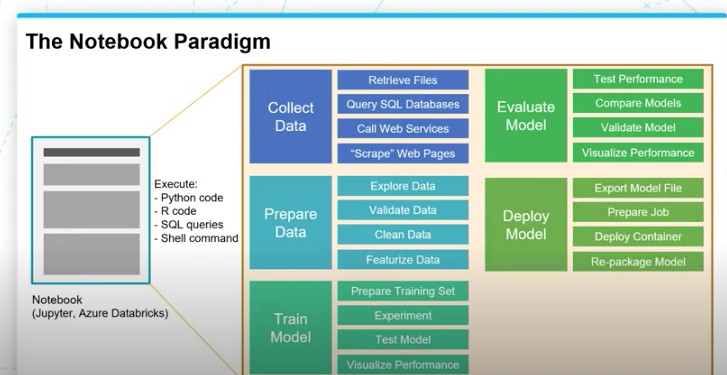
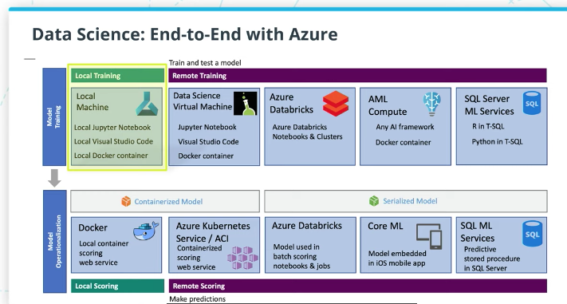

# Azure-ML-Training

## Contents

 Basics of Machine Learning 

  
* [Intro to Machine Learning](#intro-to-machine-learning)
* [Defining and Differentiation machine learning](#defining-and-differentiating-machine-learning)
* [Story of machine learning](#story-of-machine-learning)
* [The data science process](#the-data-science-process)
* [Types of data](#types-of-data)
* [Tabular data](#tabular-data)
* [Scaling data](#scaling-data)
* [Encoding data](#encoding-categorical-data)
* [Image data](#image-data)
* [Text data](#text-data)
* [The two perspectives of machine learning](#the-two-perspectives-of-machine-learning)
* [The machine learning ecosystem](#machine-learning-ecosystem)
* [Essential Libraries](#essential-libraries)
* [Cloud services](#cloud-services)

## Intro to Machine Learning

Machine learning in the perspective of:

* Computer science:
> We are using **input features** to create a **program** that can generate the **desired output**.

* Statistical:
>We are trying to find a **mathematical function** that, given the values of the **independent variables** can predict the values of the **dependent variables**.

## Defining and Differentiating Machine learning

**Machine Learning vs Traditional Programming**

The Definition:

>Machine learning is a data science technique used to extract patterns from data, allowing computers to identify related data, and forecast future outcomes, >behaviors, and trends.

  Data science deals with identifying patterns in data and using it to make predictions or map relations between data points; Machine learning is a technique used by data scientists to forecast future trends using existing data and outcomes implimenting various algorithms which learn and identify data patterns among the give data points.

The following image depicts data science and its multiple desciplines:

## Story of Machine learning

Artificial intelligence started in 1950s which is all about writing algorithms that mimic human thought process. Machine learning then came to write programs which identify data patterns without explicitly being programmed. Deep learning with the discovery of neural nets is the breakthrough that drove the AI boom and also complex machine learning applications such as language processing and image classification.

Many hidden layers and hidden nodes made the field to be called as deep learning.

## The Data science process

1. Collect Data - From various sources such as, but not limited to:
  * Files
  * Databases
  * Webservices
  * Scraping/Crawling webpages
  
2. Preparing Data - Data cleansing (removing undesirable values and baised data points from the data set) and Data visualistation (visualing data using plots/graphs)

3. Training Model - setting up model pipeline by feature vectorization, feature scaling and tuning machine learning algorithm. evaluating mode performance thorugh variance evaluation matrxi to understand and evaluate the training cycles of the model.

4. Evaluate Model - Testing and comparing the performance of multiple trained versions of the model with the test data.

5. Model Deployment - As a part of Devops which **integrate training, evaluation and deployment scripts for respective builds and realease pipelines**.They make sure all the versions of the model deployments are versioned and artifacts are archived.

6. Retraining - Based on the business need, we might have to re-train our machine learning models going through the processes of Training-Evaluation-Deployment for the new re-trained version.

## Types of Data

The form and structure of the data plays a crucial role in deciding the machine learning algorithm to use, values of hyper parameters and problem solving methodology.

> Its all numerical at the end!

* **Numerical Data -** Data that is in the numerical form or that has been converted from other data forms into numerical such as speech or image data coverted into numerical data points.

* **Time-Series Data -** Numerical values that can be ordered. Typically data collected over equally spaced points in time, and can also include data that can be ordered with a non date-time column.
  * **Examples of non-date time column time series data:** Real-time stock performance, demand forecasting and speech data that will be translated into a time-based frequency values.
  
* **Categorical Data -** Discrete and limited set of values which doesnot add any sense of value to the data unless it is categorized/grouped together.

* **Text -** Transforming words and texts into numbers understandable by machine learning algorithms is a challange by itself.

* **Image -** Transforming Image into numeric form is a challange similar to the text for developing machine learning algorithms.

## Tabular data

The most common type of data available for most of the machine learning problems is the tabular data.

Defining the elements of tabular data:

**Row:** Item/entity in a table.

**Column:** Property of the item/entitiy. They can be continous or descrete(categorical) data.

**Cell:** A single component of the table describing an item in the x-direction and its property in the y-direction.

> **Vectors-**
> A vector is simply an **array of numbers**, such as (1, 2, 3) or a nested array that contains other arrays of numbers, such as (1, 2, (1, 2, 3)).

## Scaling data

Scaling means transforming data within a scale (most commonly used are 0-1 and 1-100). As all of the data will be transformed uniformly to the required scale this wont impact the model's prediction outcome. Scaling will be done to improve the performance of the models training process as the data is now scaled to a smaller value.

There are two mathematical methods of scaling **standardization** and **normalization**:

> **Standardization** scales the data to have Mean = 0 and Variance = 1. This can be done by first subtracting data mean from the input and then divinding it with the variance.

`(Input - Mean)/(Variance)`

> **Normalization** rescales the data into a range `[0-1]` inclusive. Minimum value of the data set will be subtracted from the input and then will be divided by the range of the dataset(Range = Maximum values - Minimum value).

`(Input - Minimum)/(Range)`

#### * Conceptual Dilemmas:
* When do we go with the scale of 1-100 in place of 0-1?

#### * When to use what:

* Normalization is good to use when you know that the distribution of your data does not follow a Gaussian distribution. This can be useful in algorithms that do not assume any distribution of the data like K-Nearest Neighbors and Neural Networks.

* Standardization, on the other hand, can be helpful in cases where the data follows a Gaussian distribution. However, this does not have to be necessarily true. Also, unlike normalization, standardization does not have a bounding range. So, even if you have outliers in your data, they will not be affected by standardization.
  
#### * Learnings:
* Scaling the training data is always a mandatory step during model training, it is also inevitable to scale the test data for predictions with the same scalar used during training.

* It is advisable pickling scalars used in training, to facilitate its usage during the actual data predictions.

* One of the techniques used to scale the data is the usage of Scikit's standard scalar function `scaler.fit_transform( )`.
  * `scaler.fit_transform( )` is used to fit the `train_x` data and tune scaler and `scaler.transform( )` is used to transform the test data.
  * The scaler takes both inputs in cases where you will need to scale the target variable. However this is used only sometimes in Linear regression tasks. In classification tasks, it makes zero sense to scale a binary or multi-label class, right? So the scaler will only scale your `train_x` numerical features in cases where you parse only the `train_x`  to the scaler.
  
* Another way to scale data is by using pandas `qcut` functionality [elaborated here!](https://pbpython.com/pandas-qcut-cut.html?utm_campaign=News&utm_medium=Community&utm_source=DataCamp.com).
  * `qcut` can be used to label data by diving them into quantitatively equally weighted buckets and then assigning them a numerical label.Its more like an encoding technique for numerical values based on their distribution of data in the given dataset.
  * Implementing this into scaling data would be by first dividing the data into desirable number of bins and assign their percentages as labels (Example: For a qcut of q=3 the labels will be = [0, 1/3, 2/3, 1]). This would help us get all the numerical data into the specified number of bins and we will use the cut ranges for these bins to scale the test data for predictions.

## Encoding categorical data

As in machine learning nothing really matters except a number, and hence we have to encode the categorical data into numbers. This acheived by two methods **ordinal encoding** and **one hot encoding**.

* **Ordinal encoding** we convert the categorical data by assigning a number in the range of 0 to (number of categories - 1) to each category in the data.

  * **Drawbacks:**
    * One of the major backs of ordinal encoding that we implicitly assume the order of category and will end up assigning numbers of various magnitudes to different categories of data without considering their correlation with the outcome.
    
    * Another major drawback with ordinal encoding is that we are not aware of the categories in unseen data of future and the weightage to be assigned to them.

* **One hot encoding** In this type of encoding, we transform each column of the categorical data into a column. If there are n categories in categorical data we will have n new coluns added. An row/item representing the column/category will get a 1 in the particular category and the rest of the column of this category will be marked as 0.

  * **Drawbacks:** Even though one hot encoding is considered as the most efficient encoding type for categorical data it also comes with few drawbacks:
    * The dimension of the data increases with each one hot encoding of categorical column as there will be as many new columns as the number of categories in the column.
    
    * The other major drawback of one hot encoding is the input structure of the data will not be the same as the dimension of the input data depends on the number of categories in the data.

#### * Learnings:

* The problem of unseen future categorical data can be addressed by using an additional category of others to have the new categories categorized in the encoding. And always remeber that if the number of new categories increase significantly retraining will be the only option to go with.

## Image Data

Pixels are the building blocks of images and a large stream of pixels spread across lenth and breadth will form an image. Pixels again constitutes of 3 channels **RGB(Red,Green and Blue)** each channel has a value range of (0-255). The variation in these 3 channels across the value range forms a picture.

But there is a catch the above mentioned three channels for a pixel is for a color image. For a Grayscale image its a single channel in which 0 - represents white and 255 represents black and this single channel will make up to the entire spectrum of grayscale.

The number of channels required to represent the color is known as the **color depth** or simply **depth**. With an RGB image, `depth = 3`, because there are three channels (Red, Green, and Blue). In contrast, a grayscale image has `depth = 1`, because there is only one channel.

#### Encoding image

As we know everything at the end has to be represented as numbers for machine learning and hence the image data too. To reproduce an image / to represent an image we need to know three things:

     1. The horizontal position of pixel
     2. The vertical position of pixel
     3. The color of the pixel

Hence we can fully represent or encode an image into number by using a three dimensional vector. And size of the vector required for a given image would be `height * width * depth`.

> Preprocessing Steps: It is important to use uniform aspect ratio for all the images; preferably a square. And image data is typically normalized by subtracting the mean pixel value in each channel (R,G & B) from all the pixels in the image.Also we might want to do to clean the input images include rotation, cropping, resizing, denoising, and centering the image.

## Text Data

Text is another important data type which has to vectorized/converted into numbers in order to make them understandable to machine learning algorithms. And this accomplished by various process techinques highlighted below:

1. **Normalization:**
   Texts often contains different words that mean the same thing and sometime there will be words with alternative spellings (behaviour and behavior). And this process of transforming a text into its official/canonical form is called normalization. And this done throught multiple processes.
   
   * **Lemmatization** Lemma is the dictionary form of a word and lemmatization is a process of reducing multiple representations of a word into a dictionary word.
     `(is,are and am)can be lematized as 'be'`
   * **Stop words** These are high frequency words unnecessary words that doesnt add in additional meaning to the sentence.
     `'Which cookbook has the best pancake recipe' can be reduced to '[cookbook,pancake,recipe]'`
   * **Tokenization** The process of breaking a sentence into set of strings that make up into sentence is called tokenization.
     `The quick fox will be tokenized into ['The','quick','fox']`
2. **Vectorization:**
Post normalization the text data has to be now encoded into numerical form and this is called vectorization. The goal here is to identify the features of the text that are relavant for our task and then get these extracted into a numerical form understandable by the machine learning algorithm. There are multiple methods of vectorizing a sentece or word and few popular onces are:

   * [Term Frequency-Inverse Document Frequency (TF-IDF) vectorization](https://en.wikipedia.org/wiki/Tf-idf)
      * As name says it all, if a term/word appears more frequently; it is inversly related to the document frequency which is adding a meaning to the entire document and hence it will be given lesser importance or lesser numerical weightage vice-versa.
      
   * [Word embedding, as done with Word2vec or Global Vectors (GloVe)](https://nlp.stanford.edu/pubs/glove.pdf)

Each chunk of text gets a vector (represented here as a row in the table) that is the length of the total number of words that we are interested in (in this case, six words). If the normalized text does not have the word in question, then the value in that position is 0, whereas if it does have the word in question, it gets assigned to the importance of the word.

text|normalized text|quick|fox|lazy|dog|rabid|hare
----|---------------|-----|---|----|---|-----|----
The quick fox|[quick, fox]|0.32|0.23|0.0|0.0|0.0|0.0
The lazzy dog|[lazy, dog]|0.0|0.0|0.12|0.23|0.0|0.0
The rabid hare|[rabid, hare]|0.0|0.0|0.0|0.0|0.56|0.12

Hence each text above is now represented into a six dimension vector. And datapoint is a vector in this six dimensional vector space. How close a vector is to another can be asserted by using parameters such as **vector distance** distance between two vectors in the n-dimensional vector space.

> Feature extraction is done for text data by ML algorithms by co-relating vector parameters such as vector distance (for accessing similarity of vectors) in the n-dimensional vector space.

## The two perspectives of machine learning

1. **Computer science perspective**

> We are using **input features** to create a **program** that can generate desirable **output**
   * **Data** will be represented in the form of a table.
   * **Row** of the table can be called as an **entity** of the table or an **observation** of the data collected in the table or an **instance**(example) of the data in the table
   * **column** of the table can be called as a **feature** or **attribute** which describes the entity
   * Each row with multiple attributes will be termed as **input vector/input features**.
     * Obtaining the right attributes or features is called as **feature extraction** and this is an important step in machine learning.
   * We feed the input features to machine learning program to obtian desirable **output** from the model.
     > Output = Program(Input features)
     

2. **Statistical perspective**

> We are trying to finding a **mathematical function** which can predict the values of **dependent values** with the given **independent values**

   * In statistical view, machine learning is trying to figure out a function **f**. Which when given with an **input** or **input of independent variables** gives us an **output** or **depedent output variables**.
   * This is denoted as:
     * Output = Function(Input)
     * Dependent variables = f(independent variables)
     * Y = f(X)
     * If there are multiple input variables it is called as **input vector**(X1,X2,X3..) and the function will be:
       * Y = f(X1,X2,X3..)

## Machine learning ecosystem
The ecosystem contans the following majorcomponents:

1. **Libraries** it is a pre-written code that can be re-used by calling its methods,objects and other parameters of the code. [Few impoartant machine learning libraries](https://www.geeksforgeeks.org/best-python-libraries-for-machine-learning/)

2. **Development environment** it is an application that helps with you with writing and testing your code for developing machine learning algorithms. Jupyter and Visual studio are few examples.
   * **Notebooks** are development environments which have tools that help developers in writing runnable code, output generation, data formating and visualisation.
     * Notebooks contain several cells in which the code is written and these cells can be executed individually to obtain output.
     * The output of each cell is stored and will be propogoated to the next cells of the notebook.
     * when a notebook is shared the code along with their outputs will be shared so that people can understand output of each code cell and understand the development.
     * Please find the illustration of the entire data science process in a notebook below:
       
 3. **Cloud services** development environments are limited to resources of your machine and to train a model with a huge test data sometime the resources in your machine wont be sufficient and hence we have cloud services equiped with power resources and integrators which can get complex machine learning tasks done with ease.

**Here is an illustration on end-to-end environment offered by Azure:**

## Essential Libraries

Here are few essential libraries(with their source links for reference) of machine learning:

1. Core Frameworks and Tools

   * [Python](https://www.python.org/) and `R` are one of the most popularly used core programing languages for machine learning
   * [Jupyter Notebook](https://jupyter.org/) is the development environment in which we write, test and deploy our machine learning developments
   * [Pandas](https://pandas.pydata.org/) is a library used to analyze and manipulate tabular and time-series data
   * [Numpy](https://numpy.org/) provies support for large multi-dimensional arrays of data and multiple complex mathematical functions that can be applied on these arrays

2. Data Visualisation

   * [Matplotlib](https://matplotlib.org/) is a datavisualisation library used to create 2D graphs and plots of the dataset. It is implimented in multiple other libraries such as Seaborn and Scikit-Learn.
   * [Seaborn](https://seaborn.pydata.org/) is a visualisation library used over matplot, and provides high level interface and helps in making data more informative and attractive.
   * [Bokeh](https://docs.bokeh.org/en/latest/index.html) is a high level visualisation library, it generates an interactive visualisation using HTML and Javascript against static images of matplot and seaborn
   * [Plotly](https://plotly.com/python/) is not a library but rather a company which provides different front end tools for machine learning including an exhaustive data visualisation library for Python

3. Machine Learning and Deep Learning

   * [Scikit-learn](https://scikit-learn.org/stable/) python library designed for machine learning and is designed over scientific and macnine learning libraries such as Numpy, SciPy and Matplotlib
   * [Apache Spark](https://spark.apache.org/) Used for large scale data processing and big data. It is an open source analytics engine designed for [cluster computing](https://en.wikipedia.org/wiki/Computer_cluster)
   * [TensorFlow](https://en.wikipedia.org/wiki/Computer_cluster) open soruce deep learning library from Google
   * [Keras](https://keras.io/) is another deeplearning library that simpliifies working with tensorflow using APIs for interfacing
   * [Pytorch][https://pytorch.org/] is an opensource library developed by Facebook. 
     > It is know for being compartively easy to use for deep learning for developers familar with Python

## Cloud Services

Cloud services offer support to manage core assets and resources.

1. Core asset management (support for assets needed for ML projects)

Feature|Description
-------|-----------
Datasets|Define, version, and monitor datasets used in machine learning runs.
Experiments / Runs|Organize machine learning workloads and keep track of each task executed through the service.
Pipelines|Structured flows of tasks to model complex machine learning flows.
Models|Model registry with support for versioning and deployment to production.
Endpoints|Expose real-time endpoints for scoring as well as pipelines for advanced automation.

2. Resource managed (for running ML tasks)

Feature|Description
-------|-----------
Compute|Manage compute resources used by machine learning tasks.
Environments|Templates for standardized environments used to create compute resources.
Datastores|Data sources connected to the service environment (e.g. blob stores, file shares, Data Lake stores, databases).

